# Render review 20260928T131657Z-73c66e0e8212-b02f5c89

Source `73c66e0e8212620180d943505cdbc2ee113642f5`; automated result **passed**; visual review **unreviewed**.

Input mode: `repository-defaults`. Stage logs are sanitized best-effort, not a secrecy guarantee.

## kitchen

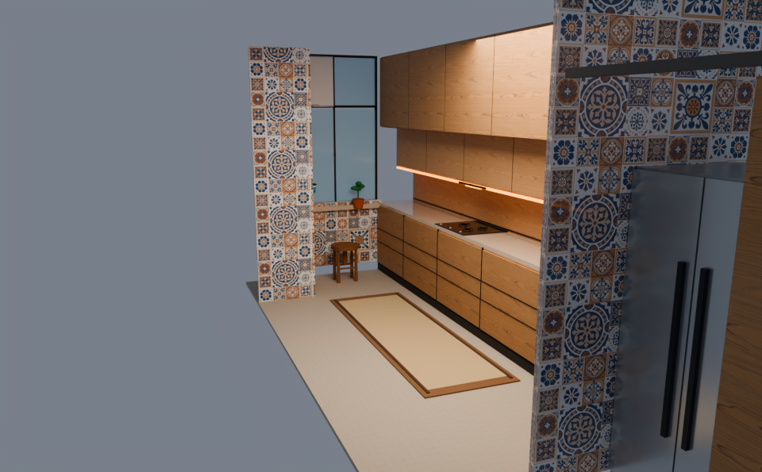

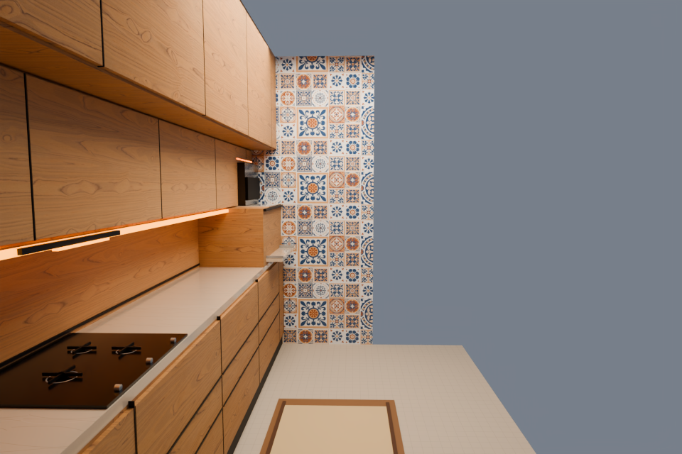

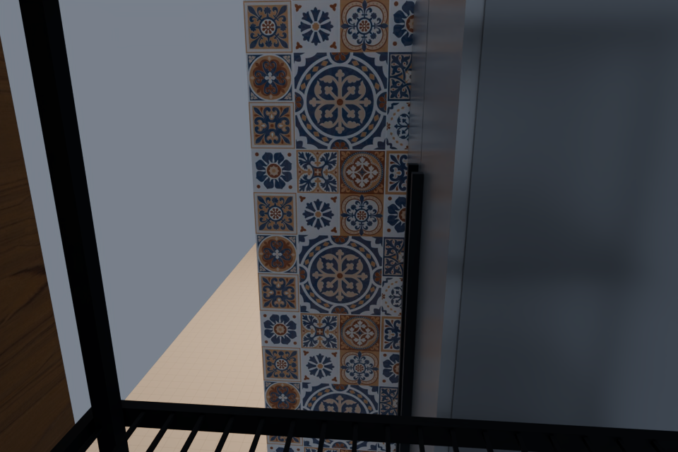

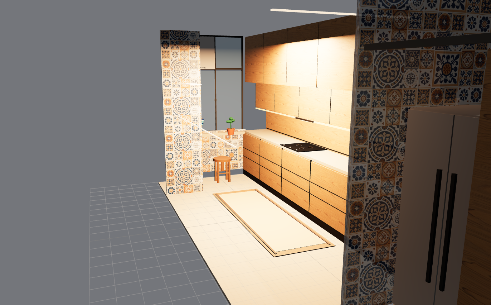

## balcony

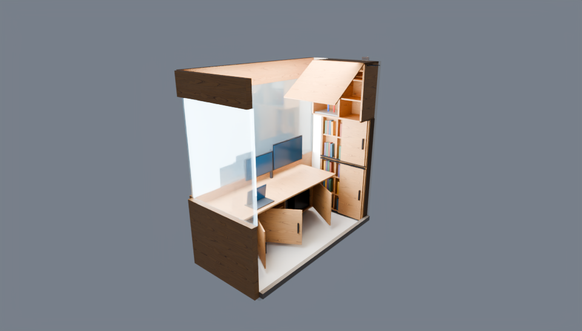

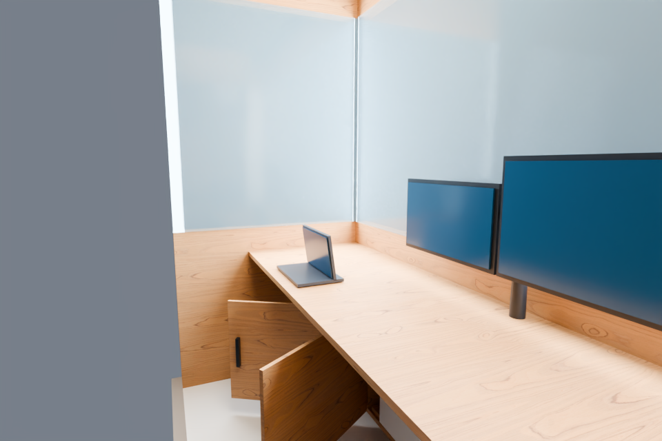

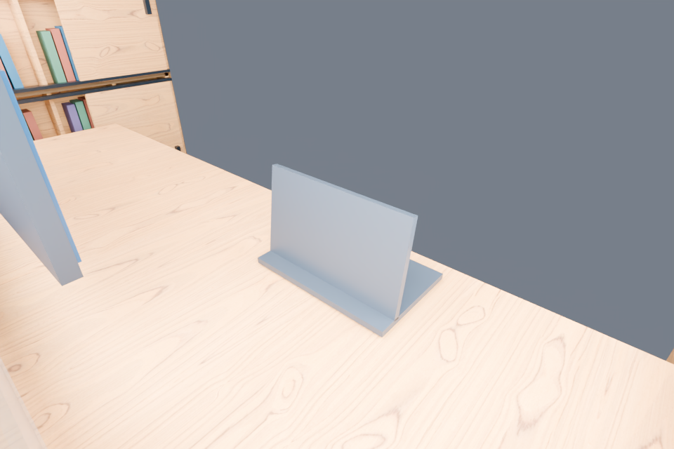

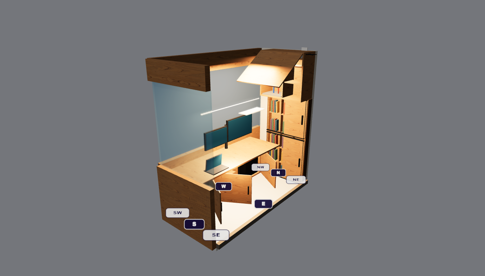

## drawing

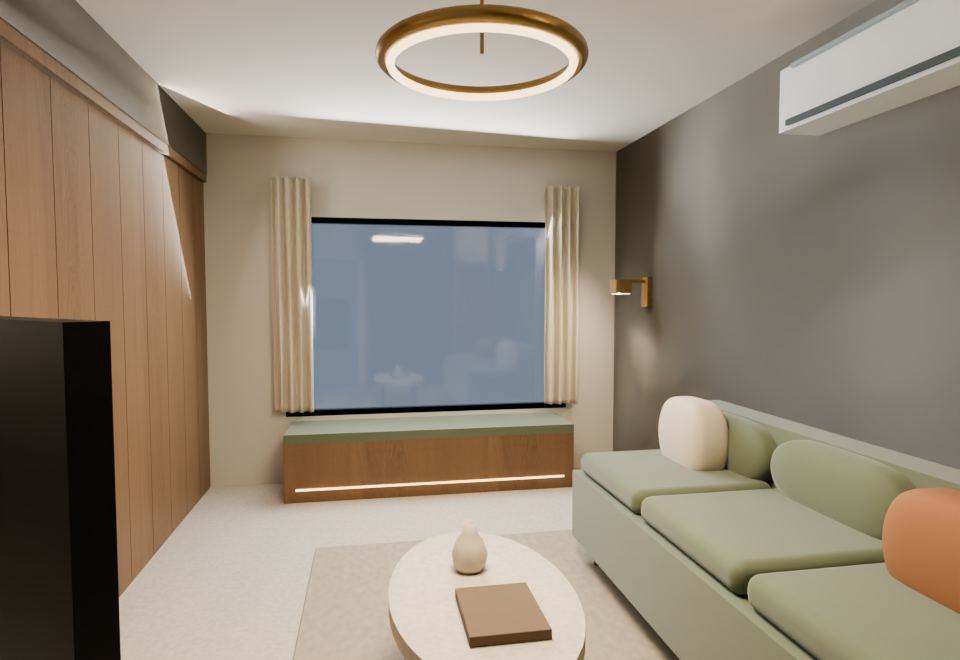

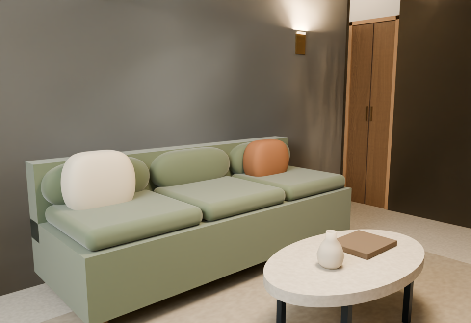

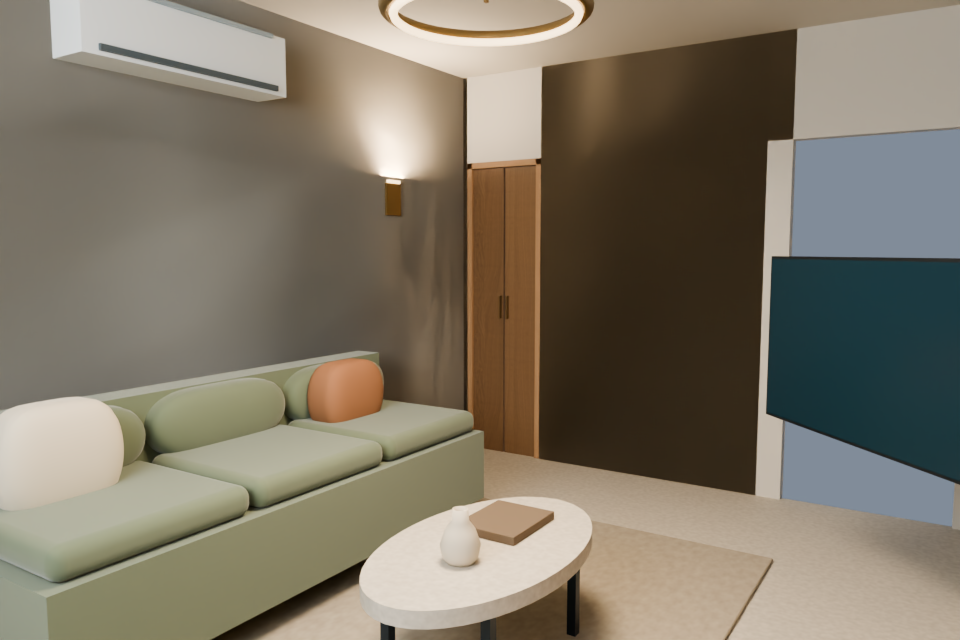

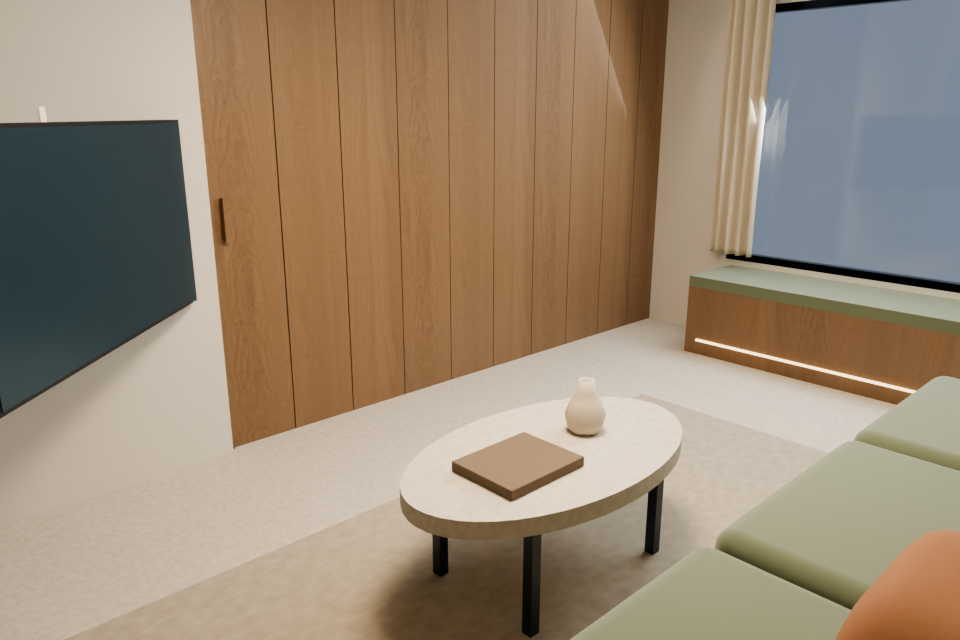
